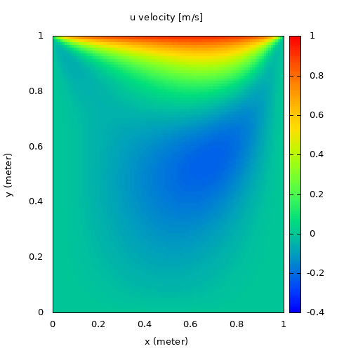
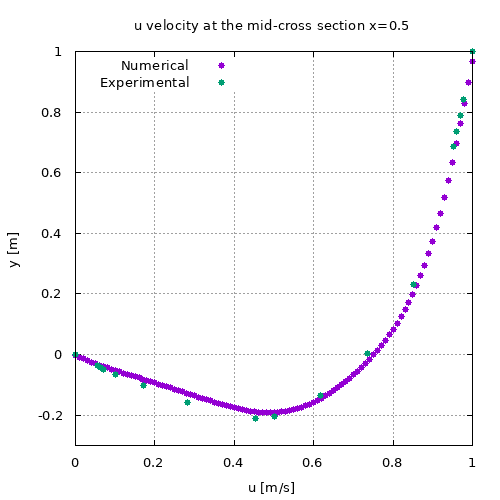

# 2D Lid-driven cavity

2D LDC solver using FVM. Hybrid differencing scheme for convection-diffusion, 
SIMPLE algorithm for pressure velocity coupling. SOR (Successive Over Relaxation) 
was used to solve the pressure correction equation. 

Compilation:
```
g++ main.cpp -o main
```
Execution:
```
./main
```
Post-processing with Gnuplot:
```
cd post
gnuplot -p gnuplot_script.p
```



